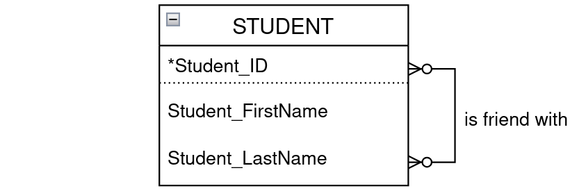
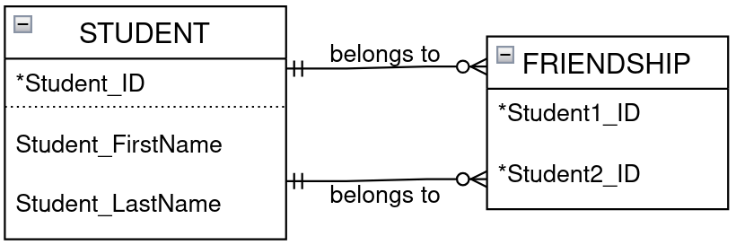
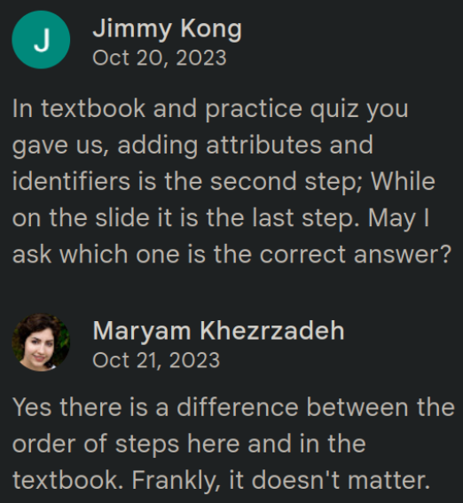
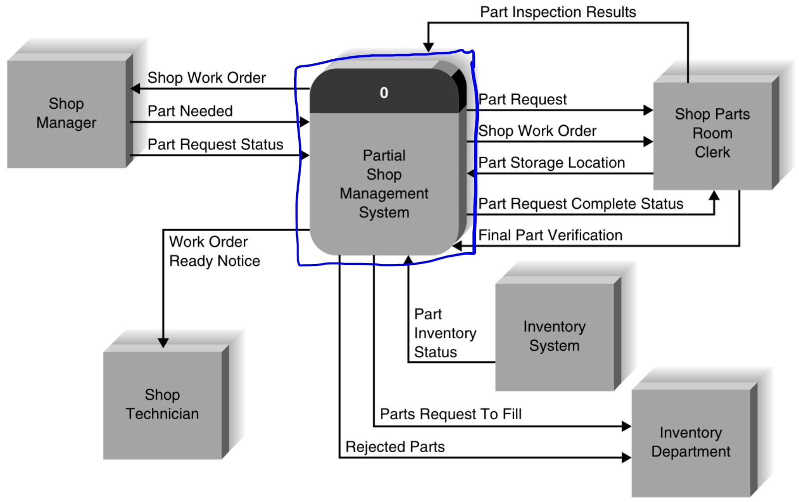
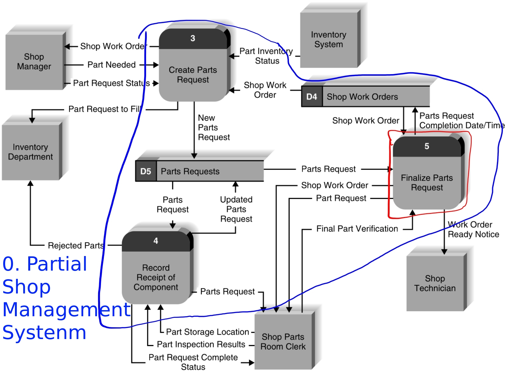
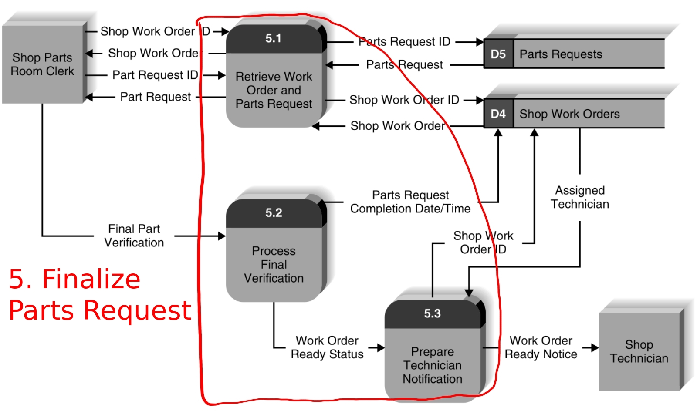
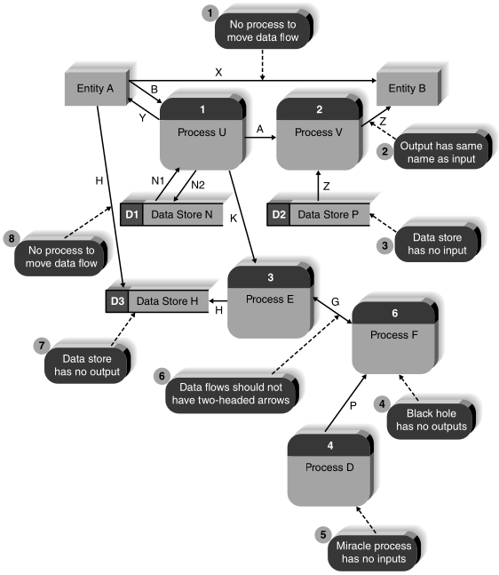
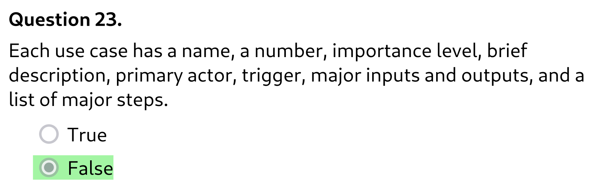
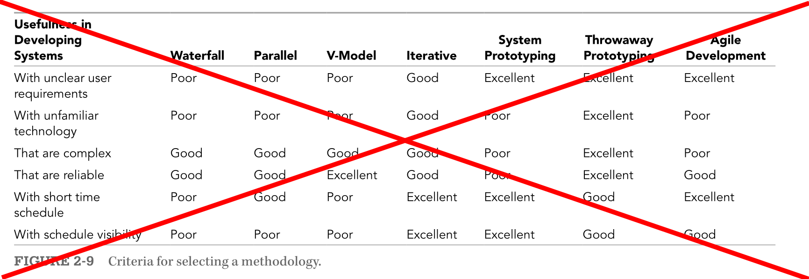
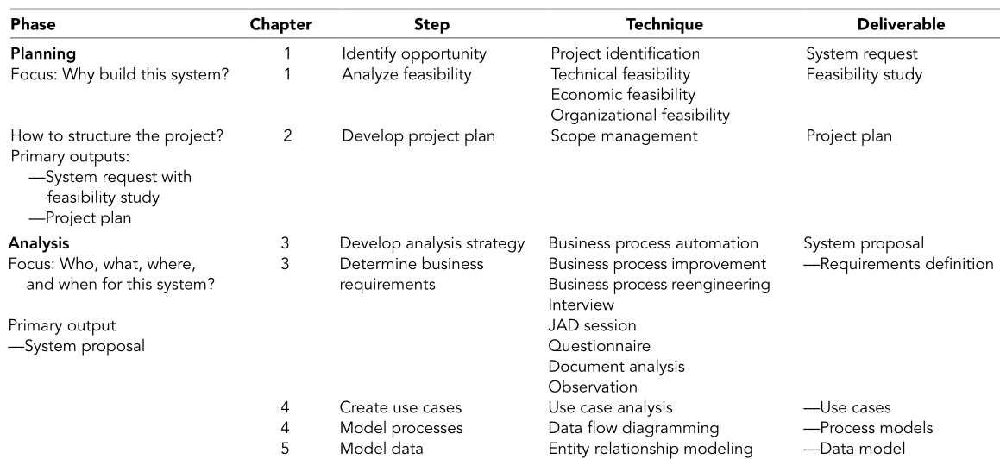

---
author:
  - name: felistachio
    avatar: "https://avatars.githubusercontent.com/u/181042133?v=4"
    link: "https://github.com/pnguyen72/"
label: "Midterm guide"
description: "Study tips and what to look out for in each module."
image: https://quiz.comp1712.ca/images/license.png
icon: info
---

## Study tips

### Where's the lamb sauce?

#### Primary sources

- Lecture slides
- What Maryam said in lecture

Technically, only the primary sources are examinable.
But the lectures can be (read: _are_) confusing, so you also need:

#### Secondary sources

- Textbook
- Chapter summaries

The textbook and chapter summaries can expand on and clarify concepts introduced in lectures
(the latter is less detailed, but much easier to read).
But there are also concepts not covered in the lecture at all, you don't need to know them.
Sometimes Maryam disagrees with the authors, always go with Maryam's version.

#### Tertiary sources

- [Shivaun's notes](https://shiv-bartoo.notion.site/Systems-Analysis-and-Design-8th-Edition-0f7bf214448b4171bf6f21956706b22c#42a0e0a4906f4023b8e1f3ef5d0a9ec4)
- [COMP 1712 Bible](https://docs.google.com/document/d/1MOVpEVdHEbigwvpJk2h_6VJ49L0uOAlseSyCwteGMNc)
  (our intake's crowdsourced notes)

Shivaun's notes are consistently good,
while the Bible's quality and writing style often vary.

Don't use these as your main sources, but as aids to get you started
or when none of the higher-priority sources make sense.
You don't learn much from reading someone else's notes.

### So how do you learn?

- Take notes while you study the primary and secondary sources,
  try to summarize and explain concepts in your own words. 
  Basically, create your own tertiary source.

- Review lab solutions and similar problems in the textbook. 
  The exam is very heavy with application-based questions.

- Do the practice quiz: https://quiz.comp1712.ca  
  Don't memorize the answers, but understand why they are correct.

The **exam questions do NOT come from the practice quiz bank!**

Use the quiz as a knowledge check, not to grind to memorize all questions, there's no point.
90% is good enough. Once you've gone through all questions, switch focus to other methods.

The quiz bank comes from the textbook publisher, so it's also a secondary source. Treat it with caution like I explained in that section.

### To cheat or not to cheat?

You have 47 MCQs in 1 hour, you will not have time to look up your cheatsheet during the exam.
The real "cheatsheet" is the knowledge you gain along the way! (of making it)

I recommend mostly stick to taking notes. Effectively your notes is your cheatsheet,
but you don't have to write it in a tiny size, and even in a comfortable size you can probably type faster than handwriting, so you're saving lots of time and effort.
You'll learn so much from the process of taking notes,
it's more valuable than having a physical cheatsheet in the exam room.

That said, there are some truly tricky parts where a cheatsheet may be handy.
I'll recommend what to include for each module in the review section.

## An oversimplified review

More like random things I remember about each module that may trip you,
or some module-specific tips that may be useful.
Absolutely NOT a comprehensive review of everything you should know.

The exam is heavily weighted torwards the later modules,
so I'll go over them in reverse order.

### Module 6: Entity relationship diagrams

Prepare for these types of question (all questions are multiple choice, btw):

- Given a description of a system, identify the ERD that best models it.
- Given a description of an entity, how many attributes do you need to model it?
- Conceptual questions

An entity is like a class, attributes are like instance variables.

An identifier is an attribute or group of attributes that uniquely identifies a particular instance of the entity. For example with the Student entity, the student number can be the identifier. The social insurance number can also be the identifier. Or perhaps the combination of last name, first name, and date of birth (if you're sure the combination is unique for every student).

But **each entity has ONLY ONE identifier**, no exceptions! When designing an ERD, if there are multiple candidates for the identifier, you must choose one.

Suppose you make Student's identifier the combination of last name + first name + dob. It does NOT mean this entity has multiple identifiers. Last name is not an identifier, first name is not an identifier, dob is not an identifier. Only the _combination_ of them is _the_ identifier.

When modelling a many-to-many relationship, it's best practice to
break it into 2 one-to-many relationships.

The identifier of the intersection entity is usually the combination
of the identifiers of the entities it's associated with. In this case, Friendship's identifier is `Student1_ID + Student2_ID`. But remember **each entity has ONLY ONE identifier!** `Student1_ID` and `Student2_ID` are identifiers of the Student entity, but they are not identifiers of the Friendship entity. Only their _combination_ is _the_ identifier of the Friendship entity.

In this module there is one point where Maryam disagrees with the textbook authors: the order by which you create ERD.

Does it really not matter? Who knows. It didn't come up in the last midterm.
But if it does, go with Maryam's version.

For this module, doing the practice quiz helps but won't suffice.
Review lab 6 solution and read the explanation of ERD in the textbook.
Learning the syntax goes without saying,
but the important part is the reason why a system is modeled a certain way.

Consider copying 1 or 2 ERDs into your cheatsheet if you don't feel confident.
Don't pick too complex ones so that you don't have to
spend time deciphering them in the exam.

### Module 5: Data flow diagrams

Prepare for these types of questions:

- Given a description of a system, identify the diagram that best models it.
- Given a higher-level diagram, identity the most correct lower-level diagram.
- Given a diagram, is it valid? If not, identify the error(s).

The highest-level DFD is the **context diagram**, which has one process
(representing the entire system) and _all_ external entities that the system interacts with.
No data stores.

The **level 0 diagram** is like you're zooming into the system process.
You see the processes that compose the system process, and _all_ the data stores.
There are no extra external entities.

The area inside the blue boundary is Process 0 in the context diagram, only shown with more details.
Every data flow in/out of Process 0 must correspond to
a data flow in/out of this area. This act of keeping the higher and lower level diagrams in correspondence
is called **balancing**.

You can zoom into each process
in the level 0 diagram to get a **level 1 diagram**.
This is the level 1 diagram for Process 5, you can see its subprocesses:

There are no data stores that the level 0 diagram doesn't have.

And similarly, every process in the level 1 diagram has a level 2 diagram
which further divides it into subprocesses.

Review lab 5 solution and
read all examples in the textbook of how to create DFDs to get a feel for them. Even if you can get 100% on the practice quiz
in 5s while the screen is upside down, if you don't have the practical experience,
**you are screwed**!

I recommend copying to your cheatsheet a level 0 diagram, a corresponding level 1 diagram, and figure 4-25.
You don't need to understand the diagrams; what you want is
examples of what's valid and what's not, so that you can compare them to
what's given in the exam. So choose some complex ones to cast a wide net.

### Module 4: Use cases

For module 1-4 the questions are mostly conceptual.
But the majority of questions in the exam are on module 5 and 6.

The actor in a use case can be anything that interacts with the system.
It could be a person, a department, or a machine. If it's a person, rarely is it an individual person,
but usually a collective noun for the role of the person in the system
(e.g. "customer", "store manager").

Beware of this "trap" question:

It's false because the format and content of a use case vary by organization.
Not _all_ use cases follow this format, this is just the format that they teach you.

In general, if a question uses absolute terms like "always", "never", "every", it's likely false.

For this module, doing the practice quiz helps but won't suffice.
Review lab 4 solution and read examples of use cases in the textbook to get a feel for them.
Consider copying one to your cheatsheet if you don't feel confident.

### Module 3: Requirements

One major source of confusion is what's the difference these two groups,
and how they're related to each other.

|                Requirements  elicitation techniques                | vs  |                                                                        Requirements  analysis strategies                                                                        |
| :-------------------------------------------------------------------: | :-: | :--------------------------------------------------------------------------------------------------------------------------------------------------------------------------------: |
| Interview JAD Questionnaire Observation Document analysis |     | Problem analysis Root cause analysis Technology analysis Duration analysis Activity-based costing Informal benchmarking Outcome analysis Activity elimination |

Elicitation techniques are the media by which you obtain info;
analysis strategies are the types of info that you obtain.
They go together as two different aspects of the requirements determination process.

For example, if your technique is questionnaire,
you can ask participants to identify problems with the current system (problem analysis),
how long it takes to do certain tasks (duration analysis),
how much it costs (activity-based costing), etc.

Or, if you want to know how other organizations perform (informal benchmarking),
you can do so by interviewing their people (interview),
reading their documentation (document analysis),
observing their work (observation), etc.

You don't choose either an elicitation technique or an analysis strategy.
You choose _among_ the elicitation techniques and _among_ the analysis stratgies, and you do both.

The practice quiz should adequately teach you the differences among the elicitation techniques.
But it has very few questions on the analysis strategies.
IIRC the last midterm was heavier on the latter group,
so make sure you study them from other sources.

Last midterm 4/47 questions came from the module 3 graded quiz.
Review the questions you did wrong and share them on Discord so that everyone can learn.
(Each student can only see questions they did wrong.)

No cheatsheet needed for this module.

### Module 2: Methodologies

A project often has both a time constraint (you must finish by ...)
and a requirements constraint (you must implement ... features).
If you must choose, **time is more important**, never release a project late!
Missing features can be added in the next versions.

**Do not use this table!**

It's misleading because it gives you the impression that Waterfall is always bad and Throwaway is always good.

But it's usually a trade-off.
Prototyping (either kind) is good with unclear user requirements
because you build a prototype, ask your users to try it and give you feedback, then build the actual product.
But if the requirements are already clear, why would you do that, you would actually waste everyone's time.

Waterfall is bad if you have unclear user requirements;
but if the requirements are clear, then it doesn't matter.

Read the description of all methodologies, understand them, and apply them on a case-by-case basis.
The practice quiz has many questions in the form of "what is the best methodology if...",
do them to check your understanding (spoiler: throwaway is not the correct answer for everything).
The COMP 1712 Bible has [two improved versions](https://docs.google.com/document/d/1MOVpEVdHEbigwvpJk2h_6VJ49L0uOAlseSyCwteGMNc/edit?tab=t.0#heading=h.x2nw6y71c66r) of the methodology table, you may find them useful.

All that said, neither of the last 2 midterms had any questions about methodologies,
so don't worry too much about this. No cheatsheet needed.

### Module 1: The SDLC

This table is your best friend throughout the term.

It gives you a bird's-eye view of the course, how everything you learn fits into the entire picture.
The content of the table may not be on the exam _per se_,
but having a big picture understanding makes everything easier to digest.

Roles in a project:

- **Project sponsor**: the person/department who initated the project and serves as the project's primary point of contact
- **Champion**: the person who gives financial and political support to the project

The Sponsor and Champion are usually the same person, but they are technically distinct roles.

Don't worry about the cost-benefit analysis if you're bad at math.
You won't have to do anything remotely close to that excel lab on the midterm.
You need to understand the definitions
(e.g. tangible vs intangible benefits, pay-back period, ROI),
but no need to memorize the formulae or worry about the calculations.

Doing the practice quiz should suffice for this module. No cheatsheet needed.
