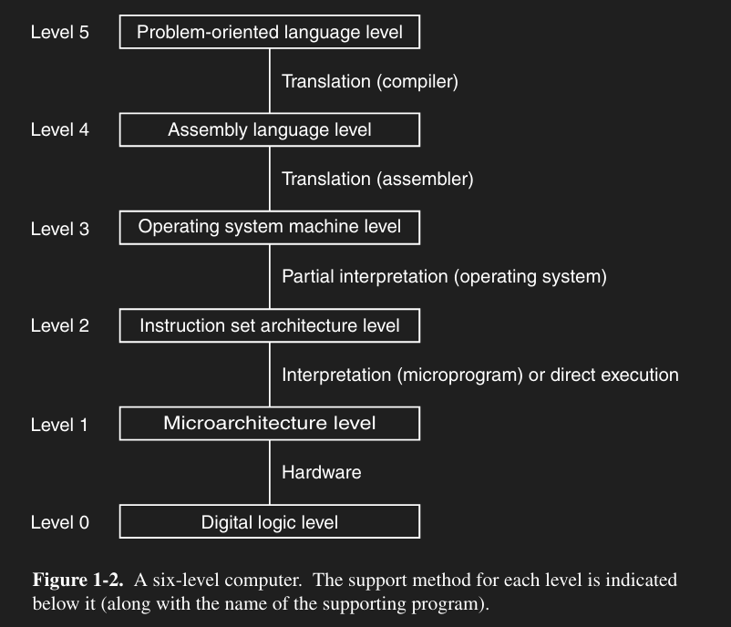

!!!warning
**WIP** 
This page is a work in progress. Feel free to help contribute by creating a [pull request](https://github.com/lunauii/bcit-resources/pulls)!
!!!

# Terminology
**Bit** - a binary digit

**Byte** - a group of 8 bits

**Word** - an fixed-size group of data
- Used to be 32 bits, is now 64 bits
- Dependent on the register size

**Bus** - an electrical line that transfers data between two devices\
**Register** - a component that stores data in the CPU

**Higher Level Language** - Language that's relatively higher in the computer architecture\
**Lower Level Language** - Language that's relatively lower in the computer architecture

**CPU** - Central Processing Unit
- Invented by von Neumann
- Continuously does the “fetch-decode-execute” cycle

**FDE** - Fetch, Decode, Execute
- The instructions are “fetched” from RAM
- They're then decoded so the CPU knows what to do
- They're then executed

**RAM** (aka **main memory**) - the memory of the computer

# Logarithms and Powers of 2
// We probably won't see *too* much of anything above tera- or below pico-, but it's good knowledge to know anyway
<table>
<tr>
<td>2^n</td><td>10^n</td><td>Prefix</td><td>Signifier</td>
<td>2^n</td><td>10^n</td><td>Prefix</td><td>Signifier</td>
</tr><tr>
<td>10</td><td>3</td><td>kilo</td><td>k</td>
<td>-10</td><td>-3</td><td>milli</td><td>m</td>
</tr><tr>
<td>20</td><td>6</td><td>mega</td><td>M</td>
<td>-20</td><td>-6</td><td>micro</td><td>μ</td>
</tr><tr>
<td>30</td><td>9</td><td>giga</td><td>G</td>
<td>-30</td><td>-9</td><td>nano</td><td>n</td>
</tr><tr>
<td>40</td><td>12</td><td>tera</td><td>T</td>
<td>-40</td><td>-12</td><td>pico</td><td>p</td>
</tr><tr>
<td>50</td><td>15</td><td>peta</td><td>P</td>
<td>-50</td><td>-15</td><td>femto</td><td>f</td>
</tr><tr>
<td>50</td><td>18</td><td>exa</td><td>E</td>
<td>-50</td><td>-18</td><td>atto</td><td>a</td>
</tr><tr>
<td>60</td><td>21</td><td>zetta</td><td>Z</td>
<td>-60</td><td>-21</td><td>zepto</td><td>z</td>
</tr><tr>
<td>70</td><td>24</td><td>yotta</td><td>Y</td>
<td>-70</td><td>-24</td><td>yocto</td><td>y</td>
</tr>
</table>

# Computer Architecture Layers
5 - **Problem-Oriented Language Level** 
    ↓ Translation (compilation) to assembly 
4 - **Assembly Language Level** 
    ↓ Translation (assembly) 
3 - **Operating System Language Level** 
    ↓ Interpretation (OS) 
2 - **Instruction Set Language Level** 
    ↓ Interpretation (microprograms) or direct execution 
1 - **Microarchitecture Level** 
    ↓ Hardware 
0 - **Digital Logic Level**

## Translation and Interpretation
In order to convert between different language levels, we need to first convert the instructions between different layers.
- This process can usually only go *down* the layers, not *up*

**Translation** is the process of converting a program from one HLL to its equivalent program in an LLL
- Converting an HLL program is done all at once
- After doing so, the HLL program isn't needed anymore

**Interpretation** is the process of converting an instruction from one HLL to its equivalent set of instructions in an LLL
- Converting an HLL program is done one instruction at a time

## Notes
- The Digital Logic Level is the only hardware level
  - All other levels are software
- Compilation can only go down to assembly level
- Multi-layered computers are a modular system
  - If you want to replace a level, you just need to also replace the conversions between its higher and lower levels
- When compiling and running a program, we end up with six different versions of the same program, each in a different language

### Patterns From Highest to Lowest Level
- Easiest to hardest to understand (for humans)
- Hardest to easiest to understand (for computers)
- Most to least powerful instructions
  - Flexible to rigid
  - Easiest to hardest to execute a high-level instruction
- Least to most amount of instructions
  - Smallest to largest files to execute
- Slowest to fastest levels
  - Most to least conversions to get to the lowest level

# Week 1 Question

**Q4.** Consider a multilevel computer in which all the levels are different. Each level has instructions that are m times as powerful as those of the level below it; that is, one level r instruction can do the work of m level r − 1 instructions. If a level-1 program requires k seconds to run, how long would equivalent programs take at levels 2, 3, and 4, assuming n level r instructions are required to interpret a single r + 1 instruction?

The first step is to define all the variables in the question. From there, we can figure out how to solve it.

Four variables: *r*, *m*, *t*, *k*\
&nbsp;&nbsp;&nbsp;&nbsp;*r* = an arbitrary level in the computer\
&nbsp;&nbsp;&nbsp;&nbsp;k = the amount of seconds for a level-1 program to run\
&nbsp;&nbsp;&nbsp;&nbsp;*m* = the power factor of a level's instructions\
&nbsp;&nbsp;&nbsp;&nbsp;&nbsp;&nbsp;&nbsp;&nbsp;1 level-*r* instruction can do the work of *m* level-(*r - 1*) instructions\
&nbsp;&nbsp;&nbsp;&nbsp;*n* = the amount of level-*r - 1* instructions required to interpret a level-*r* instruction\
&nbsp;&nbsp;&nbsp;&nbsp;&nbsp;&nbsp;&nbsp;&nbsp;1 level-*r* instruction gets converted into *n* level-(*r - 1*) instructions after translation/interpretation

Now, let's calculate how long a level-2 program takes.

&nbsp;&nbsp;&nbsp;&nbsp;A level-1 program takes *k* seconds to run.\
&nbsp;&nbsp;&nbsp;&nbsp;&nbsp;&nbsp;&nbsp;&nbsp;*k*

&nbsp;&nbsp;&nbsp;&nbsp;A level-2 instruction first has to be converted into level-1 instructions before being executed.\
&nbsp;&nbsp;&nbsp;&nbsp;One level-2 instruction gets converted into *n* level-1 instructions.\
&nbsp;&nbsp;&nbsp;&nbsp;&nbsp;&nbsp;&nbsp;&nbsp;*n \* k*

&nbsp;&nbsp;&nbsp;&nbsp;The execution of these instructions then gets sped up by our power factor, *m*.\
&nbsp;&nbsp;&nbsp;&nbsp;&nbsp;&nbsp;&nbsp;&nbsp;*(n / m) \* k*

&nbsp;&nbsp;&nbsp;&nbsp;One level-2 program will take *(n / m) \* k* seconds to run.

We can use the same logic to calculate how long a level-3 program takes.

&nbsp;&nbsp;&nbsp;&nbsp;A level-2 program takes *(n / m) \* k* seconds to run.\
&nbsp;&nbsp;&nbsp;&nbsp;&nbsp;&nbsp;&nbsp;&nbsp;*(n / m) \* k*

&nbsp;&nbsp;&nbsp;&nbsp;A level-3 instruction first has to be converted into *n* level-2 instructions before being executed.\
&nbsp;&nbsp;&nbsp;&nbsp;&nbsp;&nbsp;&nbsp;&nbsp;*(n / m) \* n \* k*

&nbsp;&nbsp;&nbsp;&nbsp;The execution of these instructions then gets sped up by our power factor, *m*.\
&nbsp;&nbsp;&nbsp;&nbsp;&nbsp;&nbsp;&nbsp;&nbsp;*(n / m) \* (n / m) \* k*\
&nbsp;&nbsp;&nbsp;&nbsp;&nbsp;&nbsp;&nbsp;&nbsp;*(n / m)2 \* k*

&nbsp;&nbsp;&nbsp;&nbsp;One level-2 program will take *(n / m)2 \* k* seconds to run.

Notice that, for a level-3 program, the degree of *(n / m)* is equal to 2.\
For a level-2 program, the degree of *(n / m)* is equal to 1.\
We can generalize this to say that for a level-*r* program, the degree of *(n / m)* is equal to *r - 1*.\
&nbsp;&nbsp;&nbsp;&nbsp;&nbsp;&nbsp;&nbsp;&nbsp;*(n / m)r - 1 \* k*\
This is how we get the formula!