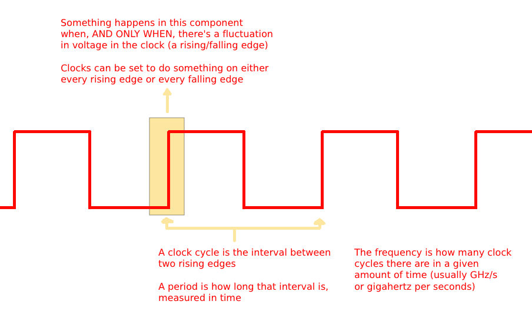
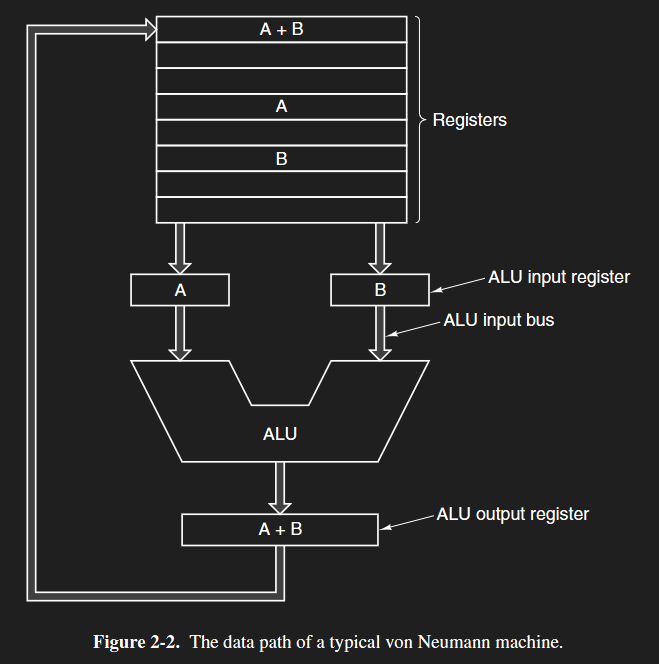
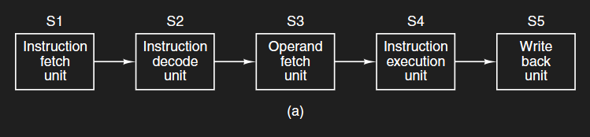

!!!warning
**WIP** 
This page is a work in progress. Feel free to help contribute by creating a [pull request](https://github.com/lunauii/bcit-resources/pulls)!
!!!

# Chapter 2: Data Paths and Pipelining

## Terminology

**Clock** - Something that can be turned on and off

**Clock Cycle** - The interval between the rising edges of the clock

**Frequency** - the amount of clock cycles per second, measured in Hertz

**Period** - the time taken per clock cycle

**MIPS** - **M**illions of **I**nstructions **P**er **S**econd
- Represents how fast a processor can begin instructions
- (Officially, the MIPS processor stands for Microprocessor without Interlocked Pipeline Stages)

**Program Counter** - Special register in the CPU that stores the address of the next instruction to be fetched

**Instruction Register** - special register in the CPU that stores an instruction to be decoded and executed

**ALU** - Arithmetic Logic Unit

**Principle of Spatial Locality** - Words with numerically similar addresses (ex: 6000, 6001) tend to be stored physically close to each other

**Principle of Temporal Locality** - Words requested by the CPU are likely to be requested again in the near future

**RISC** - Reduced Instruction Set Computer\
**CISC** - Complex Instruction Set Computer

**Pipelining** - The process of splitting the FDE process into separate stages, allowing for multiple instructions to be worked on at once

**Parallelism** - Being able to work on several instructions in the same stage at the same time

**Latency** - the total time it takes for a single instruction to finish

**Bandwidth** - the rate at which instructions are finished 
- UNRELATED TO LATENCY!

# Clock Speed and Frequency

A **clock** is anything that can be turned on and off.
- In computers, this is usually an electronic component that turns "on" when receiving 
- The "on/off" cycle tends to be a regular cycle in computers, called the **clock cycle**.
- The clock cycle's usually quite fast in computers - 100 million cycles per second

A **clock cycle** is the interval between the rising edges of the clock (on, off, on again).
- One clock cycle is rising edge to rising edge

The **frequency** of a clock (or the **clock speed**) is how many clock cycles happen per second
- Measured in Hertz (Ex: 100MHz)

The **period** of a clock is how much time passes between clock cycles
- Measured in time units
- Inverse of frequency\

Ex: 
> $Frequency = 100MHz$\
> $Period = 1/100M = 0.00000001$ s $= 10$ nanoseconds

A 1 GHz CPU has 1 billion rising/falling edges per second
1 rising edge per 1/1 billion seconds = 1 nanosecond

Clocks are involved in almost every component of a computer. Every clock cycle, that component can execute one action (ex: transfer data from RAM to CPU, decode instruction).\
The CPU can start an instruction each clock cycle.

Analogy: Imagine a bus. People at a bus stop can only board that bus every time a bus arrives at that stop.

This doesn’t mean we can finish an instruction each clock cycle - usually, finishing an instruction takes much longer than a single clock cycle.
- **Parallelism** ties in with this later!

But that's not the main concern when we want to make an efficient CPU. What doesn’t matter today is how long an instruction takes (the **latency**), or how often you can start them (the **clock speed**). What matters is the speed at which an instruction is finished (the **bandwidth**).

# The Von Neumann Datapath

- The lines are **buses** (electrical lines)
- The boxes are **registers** (CPU memory - can store one word)
- The big box has a lot of registers
- Some registers have names and specific functions

A computer has only a few dozen registers. You don’t need that many for a good CPU, though; the registers just need to be constantly running. 

## Special Registers

There are two special registers in the CPU;
- the **program counter** (PC), which stores the main memory address of the next instruction to be fetched, and
- the **instruction register** (IR), which stores an instruction to be decoded and executed.

## The Datapath Process

There are five steps to the Von Neumann data path:
1. The CPU **fetches** the address (outside of the CPU) from the Program Counter, and gets it transferred from memory using buses
Program Counter is updated with the next instruction’s address
2. The CPU **decodes** the instruction
3. The CPU grabs operands from the its registers and then transfers them to the input registers of the ALU
4. The ALU **executes** the instruction by taking in the input registers' values, modifying them accordingly, and sendind the output to the output register
5. The final value either gets sent into a register for use in the near future, or sent into RAM to be stored for later use
    - Eventually, everything goes back to the hard drive

You should note that the slowest part of the FDE cycle is the fetching part, or getting instructions and data from memory. To speed that process up, you just need to prefetch those instructions.

Programs run fast when:
- They’re constantly being provided data (so their registers are full)
- They can predict what that data is (so that they don't always have to keep going to main memory)
  - **Cache** is related to this!

You may also notice that each step is executed by a separate unit. This ties into **pipelining** later, but hold on for a second.

## The Instruction Execution "Wishlist"

There are many parts of the FDE cycle computer architects wish they could optimize. There are also reasons why they can't.

 Wish               | Flaws
 :---:              | :---:
 All instructions are directly executed by hardware, as hardware runs significantly faster than software (remember the multilevel computer diagram?) | Complex and expensive, plus some instructions are too complicated and should be executed by hardware (ex: connecting to MySQL)
 Instructions are issued as fast/often as possible | Complex and expensive, plus has physical limits on the hardware (wires can only get so close to each other before they start affecting each other)
 Instructions are easy to decode, preferably by making them all the same size | Long instructions can't be compressed into the same data size as short instructions, plus this idea goes against backwards compatibility (ex: decoding instructions from the 80's)
 Only LOAD and STORE instructions reference main memory | Referencing main memory is inevitable (ex: adding two values from main memory)
 The CPU's immediate memory stash is expanded by adding more registers | Expensive, power consumptive, and impractical (stored instructions might become outdated by the time they're referenced)

 ## RISC vs. CISC Architectures
 **Reduced instruction set computers** (RISC) involve fewer and simpler instructions. (ex: 3 + 3 + 3 + 3 + 3) \
 **Complex instruction set computers** (CISC) involve more and more complicated instructions. (ex: 3 x 5)

 The idea behind CISC architectures is that by implementing all common instructions directly in hardware (regardless of complexity), the CPU doesn't have to interpret as many instructions.

 Computers today are mostly RISC, with a bit of CISC.

# Cache

Jason uses a stomach-fridge-store analogy for cache. I'm going to steal it.

Imagine the CPU's registers are its stomach. Also imagine that the main memory of the computer is a Costco. The Costco is pretty far from the CPU's house, and so it wants to minimize the time it takes to get groceries from there to its stomach. Luckily for it, there's a third party it isn't aware of called the **cache**!

Whenever the CPU sends an instruction to fetch a word from main memory, the cache intercepts that instruction and sees if it already has the data the CPU wants. If it does, then it sends that word to the CPU instead of taking the long trip to main memory Costco. If not, then it goes to main memory itself, fetches a whole block of instructions near the word the CPU wants, then stores it in a fridge for the CPU. Then, it sends back the word the CPU requested.

The cache exists to try to reduce the amount of times the CPU has to get a word all the way from main memory. The less times it has to go to Costco, the faster the program runs. Storing blocks of words at a time takes advantage of two principles of locality: the **principle of spatial locality** and the **principle of temporal locality.**

## Principle of Spatial Locality

The **principle of spatial locality** states that memory addresses that are numerically close to each other are also physically located close to each other.

Jason uses a metaphor for this, regarding Tiger Woods. If you're talking about Tiger Woods, you're probably also going to talk about things like golf, holes in one, the Official World Golf Rankting, etc. Memory addresses work in a similar way; if the CPU requests the word in address 6000, it's also likely to request word 6001 soon.

## Principle of Temporal Locality

The principle of spatial locality states that words requested now are likely to be requested soon.

Continuing the Tiger Woods metaphor, if you mention Tiger Woods, you're likely to mention him again. Storing a requested word in a cache means the CPU doesn't have to fetch it from main memory again if it rerequests it.

# Interpreters

# Pipelining

## Latency

## Bandwidth