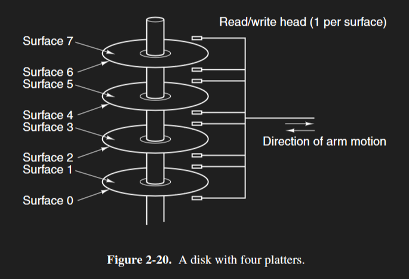
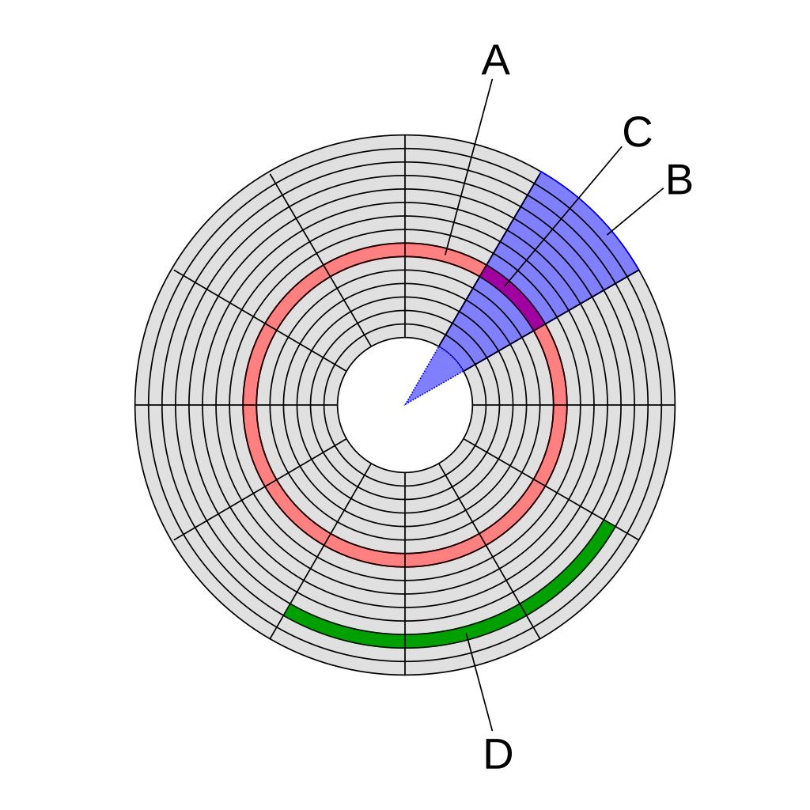
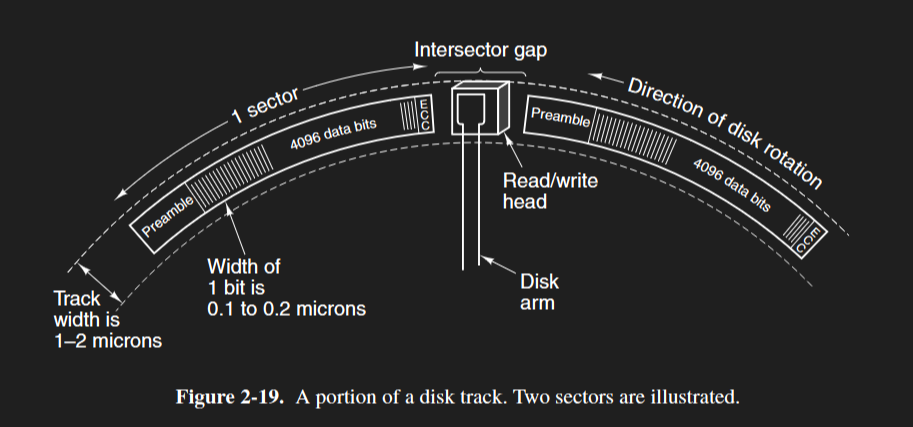

---
author:
    - name: mordinario
      avatar: "https://avatars.githubusercontent.com/u/180433833?s=64&v=4"
label: "Chapter 4: Mean Memory Access Time and Hard Drive Disks"
icon: git-pull-request-draft
---

# Chapter 4: Mean Memory Access Time and Hard Drive Disks

## Terminology

**Mean Memory Access Time (MMAT)** - the average time it takes for a fetch request to complete, controlled by the hit/miss rate of the cache

**Hit** - when a cache has the CPU's requested word\
**Miss** - when a cache doesn't have the CPU's requested word\
**Hit Rate** - The percentage of hits from a cache, over total requests\
**Miss Rate** - The percentage of misses from a cache, over total requests

**Hard Disk Drive (HDD)** - a drive consisting of platters that store data

**Platter** - a magnetic disk that stores tracks of data in a hard drive

**Track** - a circular ring of bits on a platter
- Tracks are concentric within a platter

**Sector** - a fixed-length section (slice) of a track
- **Header** (formal name is **preamble**) - a portion of redundant data before the payload in a sector, used to synchronize the read/write head
- **Footer** (no formal name, usually just called ECC) - a portion of redundant data after the payload in a sector, used to hold error-correcting code

**Intersector gap** - a gap between adjacent sectors

**Disk head (aka read-write head)** - A component that uses induction to either read or write bits from a platter 

**Cylinder** - A stack of the same tracks on different platters

**Seek** - a movement of the read/write head to the correct radial position for the track it wants to read/write to
- **Seek time** - the time it takes for the read/write heads to move to the desired track

**Rotational latency** - the time it takes for the desired sector to rotate to the read/write head
- **Rotation time** - revolutions of a platter per unit of time

# Mean Memory Access Time

Mean memory access time is the average time it takes to access a given word (mean as in average).

Every fetch request is intercepted by the cache, whose goal is to save time by already storing the requested word.

Ideally, the cache has a very high hit rate (percentage of total time saves over total requests). However, the cache has to update every now and then - spatial locality doesn’t last forever.

For example, if you're running a completely new program, and the CPU requests a completely new word, the cache isn't going to have that in its memory. It always has to miss at least *once*.
- Good quiz question - you can’t have a 100% hit rate!

To calculate mean memory access time, you're going to need three things:
- The time it takes to access the cache(s)
- The time it takes to access main memory
- The hit rate of the cache(s) (or, the miss rate)

If you have multiple layers of cache, you'll need to know the time to access all of those levels, as well as all their hit rates.

## MMAT Formulas

```
MMAT = (cache access time) + (miss rate)(main memory access)

	 = (L1 cache access time)
     + (L1 cache miss rate)(L2 cache access time) 
	 + (L2 cache miss rate)(L3 cache access time)
	 + (L3 cache miss rate)(main memory access time)
```

```
MMAT = total time / amount of fetch requests

     = [(L1 cache access amount)(L1 cache access time)
     +  (L2 cache access amount)(L2 cache access time)
     +  (...)\
     +  (main memory access amount)(main memory access time)]
     / (amount of fetch requests)
```

The cache intercepts every fetch request by the CPU, and therefore needs to be accounted for for each fetch request.
- If you have multiple layers of cache, this only applies to the first layer.

Say we had:
- 2 levels of caches
- a L1 cache access time of 1 µs
- a L2 cache access time of 4 µs
- a main memory access time of 60 µs
- 16 hits and 48 misses from the L1 cache
- 16 hits and 32 misses from the L2 cache

Using the first formula:
```
MMAT = (cache access time) + (miss rate)(main memory access)

	 = (L1 cache access time)
     + (L1 cache miss rate)(L2 cache access time) 
	 + (L2 cache miss rate)(main memory access time)

     = 1 µs
     + (48/(16 + 48))(4 µs) -> (48/64)(4 µs) -> (3/4)(4 µs)
     + (32/(16 + 32))(60 µs) -> (32/48)(60 µs) -> (2/3)(60 µs)

     = 1 µs + (3/4)(4 µs) + (2/3)(60 µs)
```

# Hard-Disk Drives
A hard disk drive is a storage component on your computer that stores data on aluminum **platters** that constantly spin.
- Platters spin really fast (usually 7200 RPM for low-end laptops, 120 RPS, 8.3 ms/revolution)

Drives can read and write data from these platters using a **read-write head** by either:
  - having a current induced from that platter's magnetic charge (reading)
  - sending an electric charge through that head and inducing a charge onto the platter (writing)

(Side note: it is a very bad idea to even just open hard drives up! They may not work again!)

Hard disk drives usually have multiple platters on them, and each platter has its own read-write head. Every read-write head is physically joined together. Each platter's also usually double-sided, and spins synchronously with the other platters.



Platters don’t actually store data themselves, instead they’re split into **tracks** - thin, concentric rings on a platter that store data.
- Tracks are labeled track 0, track 1, track 2, track 3… from outside ring to inside ring

Each platter has thousands of tracks that vertically align on each platter (track 0 of one platter is directly above/below track 0 of every other platter). Each track is also evenly split into multiple **sectors** - “slices” of tracks that serve to split tracks into specific sections. 
- Sectors are labeled sector 0, sector 1, sector 2, sector 3… in the direction that the platter spins
- Sector 0 of track 0, sector 0 of track 1, sector 0 of track 2, … are all part of the same “slice” of a track
- Data doesn’t have to be stored consecutively, though! (Quiz question)




(The geometrical sectors are the "slices" we've been talking about.)

Sectors contain:
- **Headers** (officially called **preamble**, used to synchronize the read/write head before reading)
- **Footers** (no formal name, but contains error-correcting code to make sure data is stored correctly)
- The actual data of that sectors - usually 512 bytes' worth
- **Intersector** gaps between adjacent sectors

(You'll notice there’s a lot of redundant data in sectors for formatting. Companies count that data as storable in the drive in the packaging. This is why you always have less storage than you bought.)



Sectors are read from preamble to ECC.

## Seeking and Reading

When the HDD wants to read from a sector, it has to **seek** that data. A seek is the movement of the read-write head to the specific track ring it wants to read from.
- The seek time is the time it takes for the read/write heads to move to the desired track.

During any given seek, the read-write head could be hovering over any specific track ring:
- The best case scenario is that it’s exactly where it wants to be (in which case, there's no seek delay).
- The worst case scenario is that it’s on, say, track 0, when it wants to search track 9,999.
Since it's essentially random where the head is, the average seek time is (the worst case scenario delay) / 2.

After it reaches that track, it then has to wait for the platter to rotate to the sector it wants to read from. The **rotational latency** is the time it takes for the desired sector to rotate to the read-write head.
- The average rotational latency is half of a rotation, since it’s spinning so fast it’s essentially random how long the heads wait. 

Side note, you'll notice how seeks and rotation are both physical movements. This is bad, as not only is it slow compared to digital drives, but many things can go wrong physically.

## Cylinders

**Cylinders** are stacks of aligned tracks. Say there's 10,000 tracks on four platters total. This means that there would be 10,000 cylinders, each with four tracks.

Data we want is stored on a sector, on a track, on a platter.
- Each address on a HDD is three-dimensional!

# Lecture Question

\20. How long does it take to read a disk with 10,000 cylinders, each containing four tracks of 2048 sectors? First, all the sectors of track 0 are to be read starting at sector 0, then all the sectors of track 1 starting at sector 0, and so on. The rotation time is 10 msec, and a seek takes 1 msec between adjacent cylinders and 20 msec for the worst case. Switching between tracks of a cylinder can be done instantaneously.

Information we have:
- 10,000 cylinders
- Each cylinder has four tracks, meaning the disk has four platters
- Each track has 2048 sectors

Instructions of reading a disk:
- Seek track 0, platter 0 (move the read-write head)
- Wait for sector 0 of track 0, platter 0
  - Waiting times may be removed on the quiz!
- Read sector 0-sector 2047 of track 0, platter 0
  - Takes one entire spin of the platter
- Repeat for platters 1, 2, and 3
  - The movement to the other platters are instantaneous - all the read-write heads are joined together, so they've already moved to track 0. We don't have to seek again.
  - And, since we just ended on sector 2047 in platter 0, the next sector's the exact one we're looking for - no rotational delay either!
- Seek track 1, platter 0
  - Since it's an adjacent track, the (almost) best case scenario of a 1 ms delay takes place
- Wait for sector 0 of track 1
  - You may be tempted to think about the average rotational delay. However, we already know what sector we're on; we just finished reading sector 2047.
  - So when we move to track 1, sector 0 of track 1 will have already rotated by; we have to wait the whole 10 ms for it to come back around.
  - Since we've already spent 1 ms seeking, though, we only have to account for 9 more ms of delay.
- Repeat process for every track

> Seek track 0, platter 0\
> Total time: $10$ ms (average seek time)
>
> Wait for sector 0, track 0, platter 0\
> Total time: $10 + 5$ ms (average rotational latency)
>
> Read sector 0-sector 2047 of track 0, platter 0\
> Total time: $15 + 10$ ms (time for one full rotation, and therefore one full reading of the track)
>
> Switch to track 0, platter 1\
> Total time: $15 + 10$ ms (No added time - switch is instantaneous)
>
> Wait for sector 0, track 0, platter 1\
> Total time: $15 + 10$ ms (No added time - we're already at sector 0)
>
> Read sector 0-sector 2047 of track 0, platter 1\
> Total time: $15 + 2(10)$ ms (Another full spin)
>
> Repeat for track 0, platter 2 and track 0, platter 3\
> Total time: $15 + 4(10)$ ms (Four full rotations total, since there are four platters)
>
> Seek track 1, platter 0\
> Total time: $15 + 40 + 1$ ms ("Best case", 1 ms delay)
>
> Wait for sector 0, track 1, platter 0\
> Total time: $15 + 40 + 1 + 9$ ms (Worst case, $(10 - 1) = 9$ ms delay)
>
> Read sector 0-sector 2047 of track 1, platters 0-3\
> Total time: $15 + 2(40) + 10$ ms (another full reading, another 40 ms)
>
> Seek track 2, platter 0 and wait for sector 0\
> Total time: $15 + 2(40) + 2(10)$ ms
> 
> Read sector 0-sector 2047 of track 2, platters 0-3\
> Total time: $15 + 3(40) + 2(10)$ ms\
> Total time: $10 + 5 + 3(40) + 2(10)$ ms\
> Total time: $5 + 3(40) + 3(10)$ ms\
> Total time: $5 + 3(40 + 10)$ ms (done purely to make grouping easier)
>
> Repeat for tracks 4-9,999\
> Total time: $5 + 10,000(40 + 10)$ ms\
> Total time: $5 + 10,000(50)$ ms\
> Total time: $500,005$ ms\
> Total time: $500.005$ s
