---
author:
    - name: mordinario
      avatar: "https://avatars.githubusercontent.com/u/180433833?s=64&v=4"
label: "Chapter 5: Memory Chips and Logic Circuits"
icon: git-pull-request-draft
---

# Week 5: Memory Chips and Logic Circuits

## Terminology

- **Latch** - A component that can write and store binary states

- **SR Latch** (aka **Set/Reset Latch**) - A latch with two inputs; set and reset

- **Feedback** - When the output of a circuit is fed back into the circuit as input

- **D Latch** (aka **Data Latch**) - A latch with a single input; data

- **Enable** - An input whose purpose is to allow or deny the passing through of another input

- **Rising-Edge Trigger** (aka *Pulse Generator*) -  A component that generates a pulse

- **Flip-Flop** - A component that can write and store binary states, using a clock

- **Combinational Circuit** - circuits where outputs are completely determined by the current inputs

- **Sequential Circuit** - circuits where outputs are determined by the current inputs and past inputs

- **Multiplexer** - A component that takes in $n$ inputs and has a single $1$-bit output

- **Decoder** - A component that takes in a $n$ inputs and outputs $1$ on one of $2^n$ lines

- **Memory Chip** (aka **Register Set**) - A component made of several flip-flops that stores several bits

- **ALU** (aka **Arithmetic Logic Unit**) - A component that can perform several operations on two operands

- **Bit Shifter** - A component that shifts an $n$-bit input

# Storing and Writing Memory

Storing and writing memory is hard. We need to do three things in order to have a functioning memory chip:
- Set bits
- Reset bits
- Store bits

Computer engineers went through four designs until we landed on one that was good:
- SR latches
- Unclocked D latches
- Clocked D latches
- Flip-flops

## SR Latch

A **latch** is a circuit that alters its output every time its input changes, like most electronic circuits we’ve seen so far (in COMP 1113).
An **SR latch** (or a **Set/Reset Latch**) is the first step to creating memory. SR latches involve two inputs and two outputs:\
Inputs:
- Set line (or $S$)
- Reset line (or $R$)

Outputs:
- Memory bit (or $Q$)
- Q’s complement ($\overline Q$, part of the circuit, but generally not used)

The "set" line of an SR latch sets the memory bit ($Q$) to 1. The "reset" line of an SR latch *re*sets $Q$ to 0.

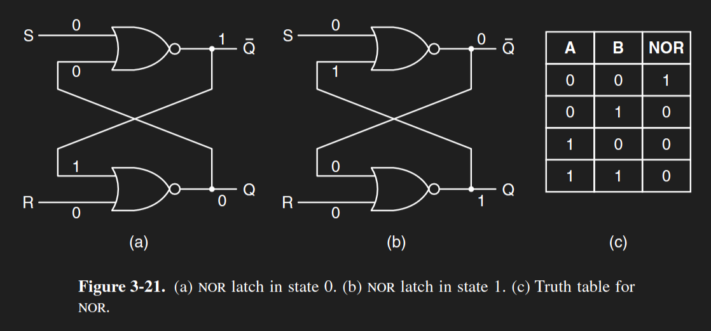

This circuit contains **feedback** - an output being routed back into the circuit as inputs.
- In order to store memory, you need to be able to store previous outputs
- Feeding those outputs back in is what creates that memory

“Set” ($S$) sets $Q = 1$. “Reset” ($R$) sets $Q = 0$. Setting neither $S$ or $R$ to $1$ keeps $Q$ as its current value.

$S$ | $R$ | $Q$ | $\overline Q$
:---: | :---: | :---: | :---:
0 | 0 | Q | !Q
0 | 1 | 0 | 1
1 | 0 | 1 | 0

SR latches can
- set bits,
- reset bits, and
- store bits.

We have everything we need to create memory!
However, you'll notice the truth table is missing a row. What if we set BOTH $S$ and $R$ to $1$, at the same time?

$S$ | $R$ | $Q$ | $\overline Q$
:---: | :---: | :---: | :---:
0 | 0 | Q | !Q
0 | 1 | 0 | 1
1 | 0 | 1 | 0
1 | 1 | !!! | !!!

The only stable state in this situation is $Q = \overline Q = 0$. This is not good, for two reasons:
- $Q$ should NEVER be equal to its complement, as they're supposed to be opposites
- As soon as either $S$ or $R$ stop sending a 1, $Q$ will jump to either 1 or 0, meaning the circuit is nondeterministic

Imagine a light bulb. Can be turned on, can be turned off, can be left alone. It CAN’T, however, be turned both on and off at the same time. This would cause a problem. We want to make sure only one state can be on at a time.

## D Latch

The easiest way to make sure only one state can be active at a time is to eliminate any invalid inputs. The SR latch's invalid input was when $S = R = 1$. We can eliminate that by setting the reset line to be the complement of the set line.

A **D latch (data latch)** does just that. It features only one input, which sets $Q$ to either $0$ or $1$ based on the input line.

Only one input:
- Set ($S$)

Same outputs as before:
- $Q$
- $\overline Q$

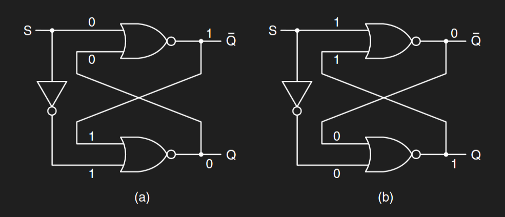

This is a fix to the S/R latch; it makes it impossible for S and R to both equal 1. However, S and R can’t both equal 0 either - meaning this circuit can’t hold memory. 

D latches can only
- set bits, and
- reset bits.

$S$ | $Q$ | $\overline Q$
:---: | :---: | :---:
0 | 0 | 1
1 | 1 | 0

$Q$ always changes whenever $S$ changes. In order to store memory, we need to be able to freeze reading from the input.

## Clocked D Latch

We accomplish input freezing with **clock lines**. As a reminder, clocks are anything that can be turned on and off. Clock lines are used to affect input lines based on if they're on or off.

Inputs:
- $S$
- Clock ($CLK$)

Outputs:
- $Q$

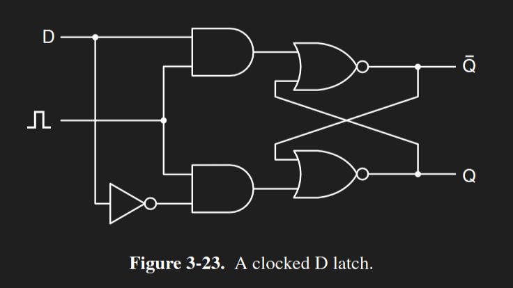

$CLK$ | $S$ | $Q$
:---: | :---: | :---:
0 | 0 | Q
0 | 1 | Q
1 | 0 | 0
1 | 1 | 1

Adding another input means we can store memory again! Whenever the clock is $0$, data writing freezes, and the state of $Q$ is stored. Whenever it's $1$, $Q$ reads the value from $S$ and sets it as its new value.

Clocked D latches can
- set bits,
- reset bits, and
- store bits.

Now, clocked D latches work fine, but the “problem” is they can't be scaled up without worrying about synchronization - if we want to use multiple clocked D latches in memory, they all have to operate at the same time. Good thing we have a thing for that!

(By the way, it's important to distinguish clock lines from data input lines. Data input lines *send* data into a circuit. Clock lines *enable* data to be sent into a circuit.)

## Rising-Edge Triggers (Pulse Generators)

A **rising-edge trigger** (or **pulse generator**) creates a short, but very clear pulse. It generates pulses by taking advantage of how NOT gates function.

Hold on this'll make sense if you look at it first

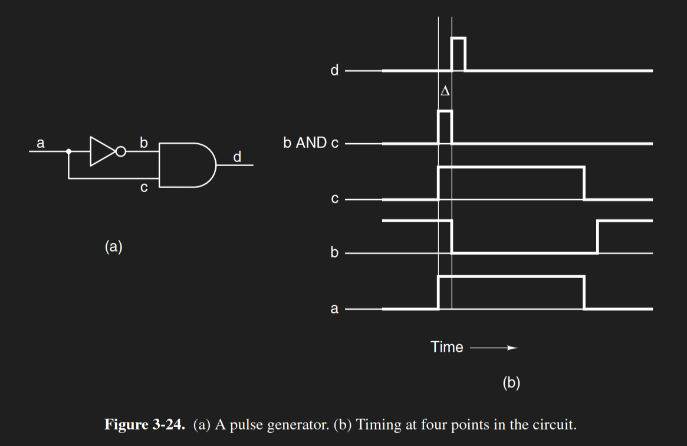

A NOT gate into an AND gate might look redundant. $A * \overline A = 0$, after all. While this is still true, there's a very short delay between the inputs of a logic gate and the output.

Say you're sending a $1$ through a NOT gate. There's going to be a very small, but existent delay between sending in that $1$ and getting a $0$ from the output. This circuit takes advantage of that delay. Check the timing in the figure.

| | Stages | | |
:---: | :---: | :---:  | :---:
$a$ | $b = \overline a$ | $c = a$ | $d = b * c$
0 | 1 | 0 | 0
1 | 1 | 1 | 1
1 | 0 | 1 | 0
0 | 0 | 0 | 0
0 | 0 | 0 | 0

It's called a rising-edge trigger because, well, it triggers whenever there's a rising edge in its input line.

We can use this pulse for:
- Sampling the state of a data line
- Synchronizing the clocks of several clocked D latches

The clocks in clocked D latches shouldn’t be going off on their own; they should all be on/off at the same time. We can do that by connecting all of them to a single pulse generator.

## Flip-Flop
A **flip-flop** is a circuit that alters its output whenever its clock line is set to $1$. This is in contrast to latches, which always altered their output whenever the data input changed.

A **D flip-flop** (or **data flip-flop**) is a combination of a clocked D latch and a pulse generator. 

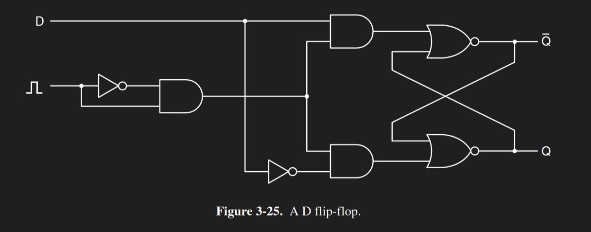

Because of the AND gate combining the data line and the clock, the data line can only change the stored bit when the clock pin outputs a $1$. This lets us store bits! 

One potential concern is that the data pin may change while the clock is inputting $1$. But as long as the generated pulse is short enough, the window for the data to change should be short enough to where that isn't an issue.

If you want to store multiple bits, you can use several D flip-flops at once and connect them all to a single pulse generator. This synchronizes all of them.

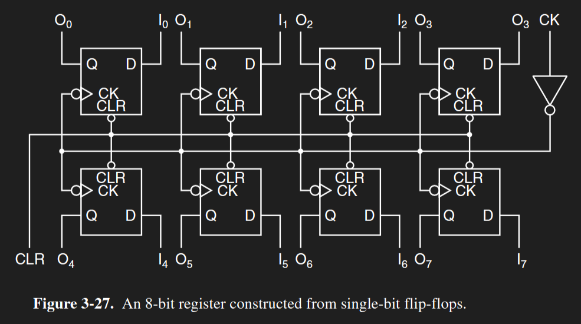

Each bit is written to on the rising edge of the clock. The pulse generator puts 1 into all 8 AND gates, and the data lines can write to the latches. When the pulse generator inputs 0, the D latches can’t write data, and all four bits are “frozen” as memory.

# Multiplexers

**Multiplexers** are components that take in $2^n$ input lines, and decide which line to output based on the combination of $n$ control lines.

Multiplexers are combinational circuits:
- A **combinational circuit** is a circuit whose output SOLELY relies on its current combination of inputs, and NOT on any past inputs.
- The inverse is a **sequential circuit**, where the output depends not just on the current inputs, but on past inputs too.

Multiplexers have:
- $2^n$ inputs
- $n$ control signals
- $1$ output

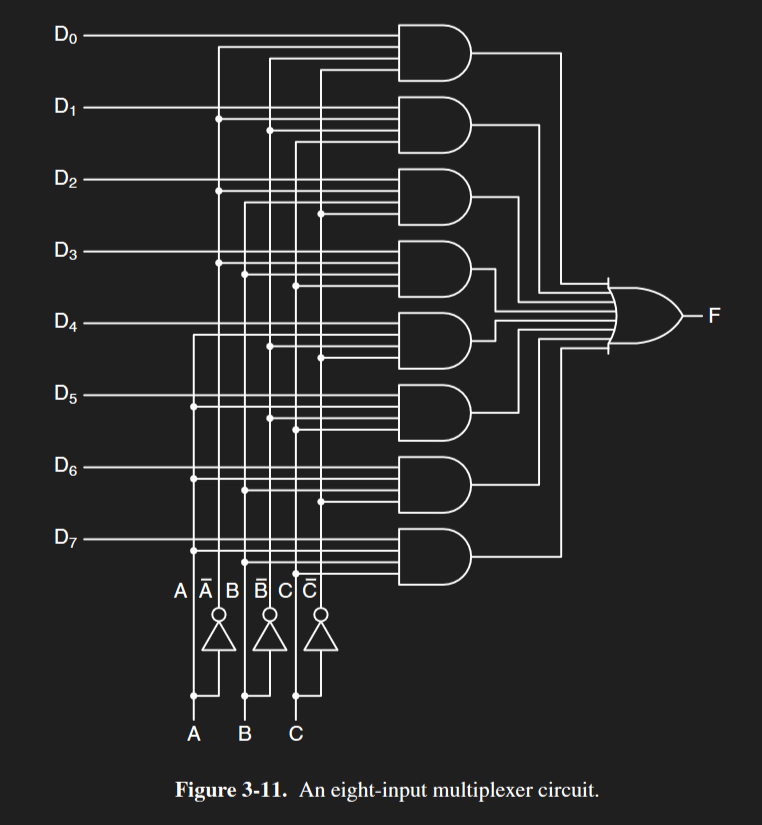

Multiplexers consist of several AND gates and a single OR gate. Any AND gate that outputs a $1$ will make the OR gate output a $1$. Each AND gate connects a single data input and a unique combination of the control signals. The control signals basically encode an $n$-bit number into each AND gate, and whatever $n$-bit number the control signal equals is which AND gate is selected. 
- Only one AND gate can be selected at a time.

Multiplexers are used for:
- Selecting a specific data input line (not how we use them)
- Programmable Boolean logic (how we use them)

For selecting data input lines, each input line is connected to a separate data source, and the control lines determine which input line to send through. Jason uses a talent show analogy; imagine a talent show with 2n contestants, n judges, and 1 contestant to be the winner. The judges' decisions decide which contestant to be the winner.
- If you want to send a different input line through the multiplexer, simply change the control lines to select the right one.

For programming Boolean logic, each control line is connected to a variable in the logic, and each data input is connected to either ground (logical $0$) or power ($V_cc$, logical $1$), based on the truth table of the logic. This means that whenever a specific combination of the control signals connects to an AND gate with a data input already outputting $1$, it'll automatically pass through to the OR gate, and the multiplexer will output $1$.

### Boolean Logic with Multiplexers

Let's pull up a truth table.

$A$ | $B$ | $C$ | $M$
:---: | :---: | :---: | :---:
0 | 0 | 0 | 0
0 | 0 | 1 | 0
0 | 1 | 0 | 0
0 | 1 | 1 | 1
1 | 0 | 0 | 0
1 | 0 | 1 | 1
1 | 1 | 0 | 1
1 | 1 | 1 | 1


This truth table has three variables, and eight possible combinations. For each combination that equals a $0$ in the truth table, we can set that respective data input to $0$. For each combination that equals a $1$ in the truth table, we can set that respective data input to $1$. 

For example, rows $0, $1$, $2$, and $4$ all equal $0$, so we connect data inputs $D_0$, $D_1$, $D_2$, and $D_4$ all to ground. Rows $3, $5$, $6$, and $7$ all equal $1$, so we connect data inputs $D_0$, $D_1$, $D_2$, and $D_4$ all to power.

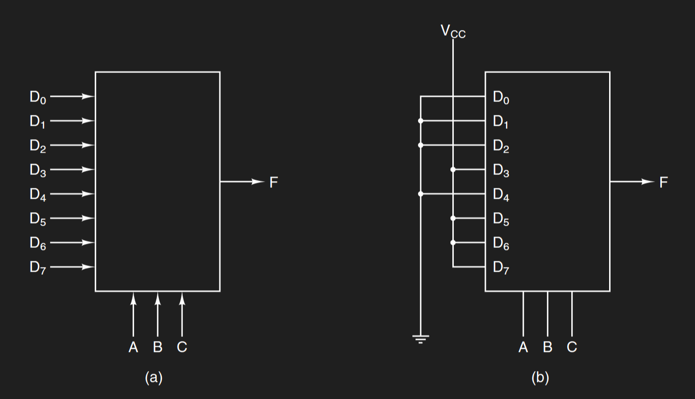

If you want to create a circuit with multiplexers, you’ll need a circuit with 1 multiplexer for each output. For example, let's look at a 1-bit half-adder.

$A$ | $B$ | $Sum$ | $C_{out}$
:---: | :---: | :---: | :---:
0 | 0 | 0 | 0
0 | 1 | 1 | 0
1 | 0 | 1 | 0
1 | 1 | 0 | 1

As there are two outputs, we'll need three multiplexers.

Ex: draw a multiplexer implementation of the following problem:
- A red light goes on if the water stream is:
  - too high\
    AND
  - too hot
- A green light goes on if the water stream is:
  - too cold\
    OR
  - too low
- A blue light goes on if the water stream is:
  - too hot\
    AND
  - too pressurized

| | Input | | | Output | |
:---: | :---: | :---: | :---: | :---: | :---:
Water high | Water hot | Water pressurized | Red | Green | Blue
0 | 0 | 0 | 0 | 1 | 0
0 | 0 | 1 | 0 | 1 | 0
0 | 1 | 0 | 0 | 1 | 0
0 | 1 | 1 | 0 | 1 | 1
1 | 0 | 0 | 0 | 1 | 0
1 | 0 | 1 | 0 | 1 | 0
1 | 1 | 0 | 1 | 0 | 0
1 | 1 | 1 | 1 | 0 | 1

We'll need three multiplexers for three outputs, and connect each data line to ground/power according to the truth table. I'd draw it out, but I don't feel like it.

# Decoders
A **decoder** is a circuit that decodes an $n$ bits of input and outputs a single $1$ in one of $2^n$ data lines accordingly. Like multiplexers, decoders are combinational circuits.

Decoders have:
- One $n$-bit input
- $2^n$ outputs

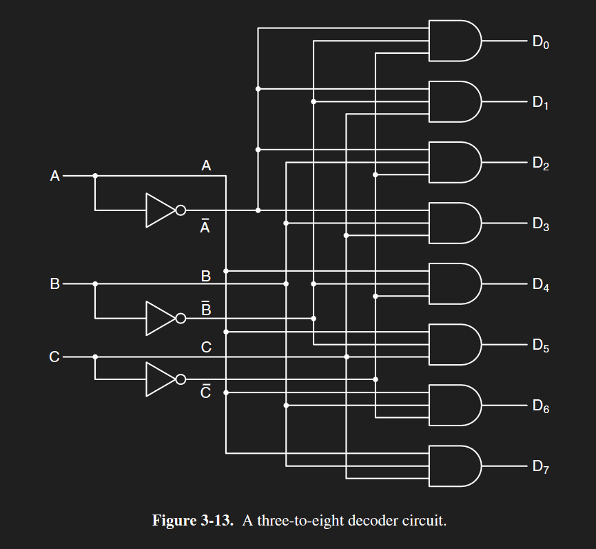

Each combination of the $n$-bit input is connected to an AND gate, leading to an output line. This means there's $2^n$ AND gates. The decoder selects an output based on the input.

# Memory Chips

This is a 4x3 memory chip (or register set).

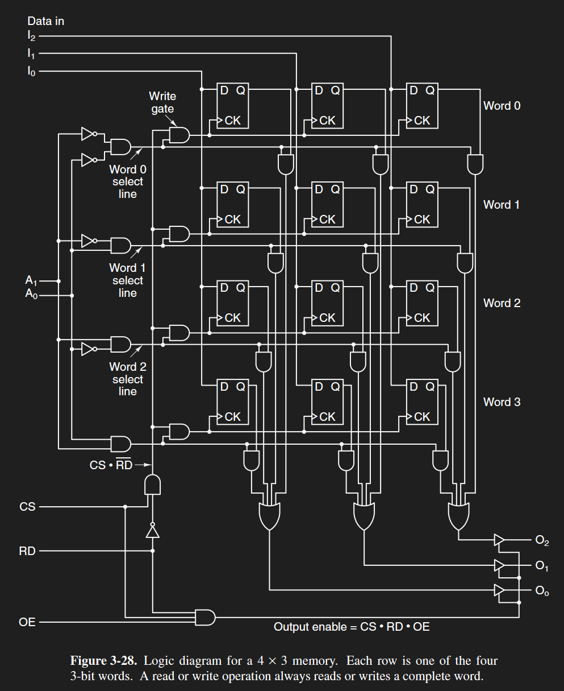

It holds four 3-bit words, each row being a 3-bit word. Each “$D$ $Q$ $CK$” box in the diagram is a D flip-flop. As a reminder:
- $D$ - Data
- $Q$ - Output/Memory
- $CK$ - Clock
  - When the clock is $0$, $Q$ doesn't change
  - When the clock is $1$, $Q$ becomes the value of the data line

You'll also notice inputs specific to memory chips:

2 **address lines** ($A_0$, $A_1$)
  - $2^2$ = 4 combinations, one for each word
  - Depending on which combination they are, that specific word will be accessed

$A_0$ | $A_1$ | Selected Word
:---: | :---: | :---:
0 | 0 | 0
0 | 1 | 1
1 | 0 | 2
1 | 1 | 3

3 **data input lines** ($I_0$, $I_1$, $I_2$)
 - Each input lines’ output will be stored onto the bit when the clock input is on
   - At least, if that word address is selected
 - Data is written to a word all at once - you can’t change individual bits

A **Chip Select** ($CS$) line
 - Represents if the current chip is being selected
 - Used in conjunction with multiple chips - you need to signify you're only sending signals to a specific chip when all the clocks are synchronized between them

A **Read** ($RD$) line
- Represents if the current chip is being read from
- Data can only be written to this chip if the $CS$ line sends $1$ AND the $RD$ line sends $0$

An **Output Enable** ($OE$) line
- Represents if the output from this chip is being read
- Data can only be outputted from this chip if the $CS$, $RD$, and $OE$ lines all send $1$

Tri-state noninverting **buffers**
- A **buffer** has three states:
  - $0$
  - $1$
  - Nothing (no output)
- Buffers generally look like NOT gates but without the circle
- Tri-state buffers have two inputs (a data line and a control line)
  - If the control line sends high, the output is the data line
  - If the control line sends low, the buffer doesn't send any output - like that component's been cut from the circuit

$C$ | $D$ | $Q$
:---: | :---: | :---:
0 | 0 | Nothing
0 | 1 | Nothing
1 | 0 | 0
1 | 1 | 1

## Memory Chip Sample Quiz Questions

What are all the input/output values required to write 001 to word 3 of a 4x3 memory chip?
- $CS$ - $1$ (We want to select this chip)
- $RD$ - $0$ (We’re not reading from this chip)
- $OE$ - N/A (We don’t need the output; whatever this is set to is irrelevant)
- $A_0$, $A_1$ - $11$ (Selecting address $11_2$ - address $3_{10}$ - word 3)
- $I_0$, $I_1$, $I_2$ - $001$ (writing $001$ to the selected address)

What are all the input/output values required to read word 0 of a 4x3 memory chip?
- $CS$ - 1 (We want to select this chip)
- $RD$ - 1 (We’re reading from this chip)
- $OE$ - 1 (We need output in order to read from this chip)
- $A_0$, $A_1$ - $00$ (Selecting address $00_2$ - address $0_{10}$ - word 0)
- $I_0$, $I_1$, $I_2$ - N/A (we’re not writing; whatever this is set to is irrelevant)

What are all the input/output values required to write 110 to word 1 of a 4x3 memory chip?
- $CS$ - $1$ (We want to select this chip)
- $RD$ - $0$ (We’re not reading from this chip)
- $OE$ - N/A (We don’t need the output; whatever this is set to is irrelevant)
- $A_0$, $A_1$ - $00$ (Selecting address $01_2$ - address $1_{10}$ - word 1)
- $I_0$, $I_1$, $I_2$ - $110$ (writing $110$ to the selected address)

# Arithmetic Logic Units (ALUs)

An **arithmetic logic unit** (or an **ALU**) is a component that takes in three inputs ($A$, $B$, $C_{in}$) and performs one of four operations on them:
 - $AB$ (AND)
 - $A + B$ (OR)
 - $\overline B$ (negation)
 - $A + B + C_{in}$ (full addition - two bits and a carry in)

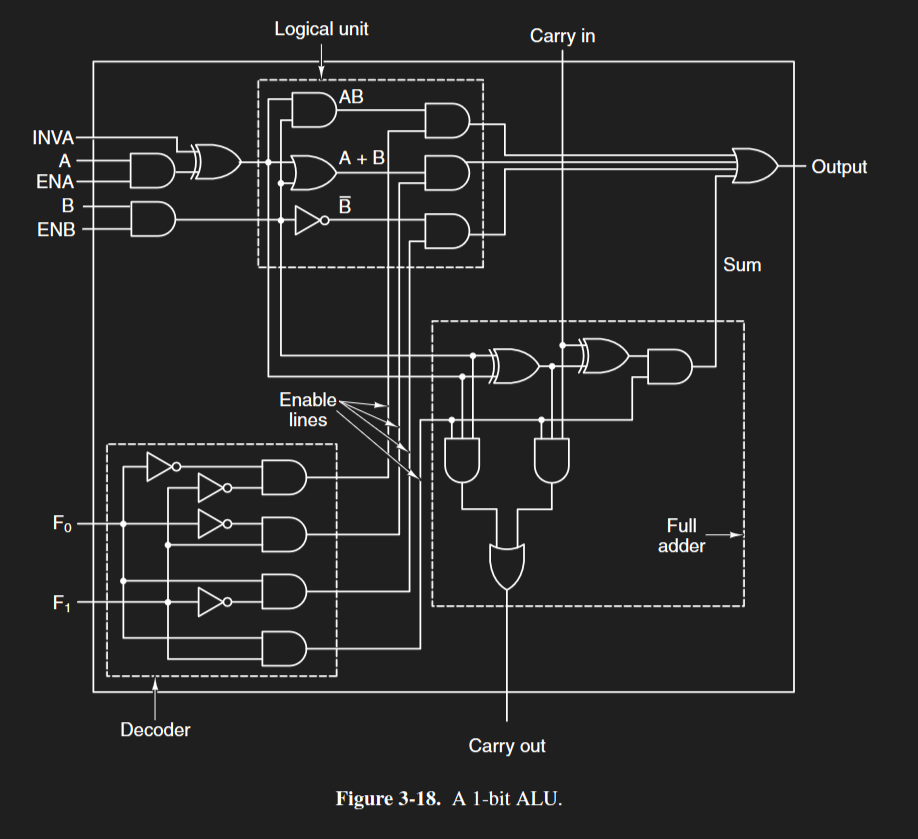

A 1-bit ALU consists of six input lines:
 - $A$
   - $INV_A$ - Invert A (inverts A input)
   - $EN_A$ - Enable A (enables A input)
 - $B$
   - $EN_B$ - Enable B (enables B input)
 - $C_{in}$ (carry in)

A 1-bit ALU also contains:
- A **decoder**
  - $F_0$ and $F_1$ as input - they decide which operation (AND, OR, NOT, Addition) to enable

$F_0$ Value | $F_1$ Value | Enabled operation
:---: | :---: | :---:
0 | 0 | AND
0 | 1 | OR
1 | 0 | NOT
1 | 1 | Full adder
 
- A **logical unit**
  - Contains the AND, OR, and NOT gates, each output of which is inputted to separate AND gates
  - The other input of each AND gate is the enable lines from the decoder
- A **full adder**
  - Adds $A$, $B$, and $C_{in}$ together, if the ALU's doing full addition
- Output lines
  - $Q$ (output) (I'm not *actually* sure if it's signified with Q, but like, it makes sense.)
  - $C_{out}$ (carry out, for full addition)

## ALU Sample Quiz Questions

What are all the input/output values required to perform the operation 0 AND 1?
- $F_0$, $F_1$ - $00$ (enables AND gate)
- $EN_A$ - $1$ (we’re inputting $A$)
- $A$ - $0$ (first operand is $0$)
- $INV_A$ - $0$ (we aren’t inverting $A$)
- $EN_B$ - $1$ (we’re inputting $B$)
- $B$ - $1$ (second operand is $1$)
- $C_{in}$ - N/A (not doing full addition; carry-in is irrelevant)
- $C_{out}$ - N/A (not doing full addition; carry-out is irrelevant)
- $Q$ - $0$ ($0 * 1 = 0$)

What are all the input/output values required to perform the operation NOT 1?
 - $F_0$, $F_1$ - $10$ (enables NOT gate)
 - $EN_A$ - $0$ (we aren’t inputting $A$)
 - $A$ - N/A (using the NOT gate only uses the $B$ input)
 - $INV_A$ - N/A (we aren’t inputting $A$)
 - $EN_B$ - $1$ (we’re inputting B)
 - $B$ - $1$ (NOT operand is $1$)
 - $C_{in}$ - N/A (not doing full addition; carry-in is irrelevant)
 - $C_{out}$ - N/A (not doing full addition; carry-out is irrelevant)
 - $Q$ - $0$ ($\overline 1 = 0$)

What are all the input/output values required to perform the operation 1 + 1 + 0?
 - $F_0$, $F_1$ - $10$ (enables full adder)
 - $EN_A$ - $1$ (we’re inputting $A$)
 - $A$ - $1$ (first operand is $1$)
 - $INV_A$ - $0$ (we aren’t inverting $A$)
 - $EN_B$ - $1$ (we’re inputting $B$)
 - $B$ - $1$ (second operand is $1$)
 - $C_{in}$ - $0$ (doing full addition; carry-in is $0$)
 - $C_{out}$ - $1$ ($1 + 1 + 0 = 10_2$ - carry out is $1$)
 - $Q$ - $0$ ($1 + 1 + 0 = 10_2$ - output is 0)

What are all the input/output values required to perform the operation 0 or 0?
 - $F_0$, $F_1$ - $01$ (enables OR)
 - $EN_A$ - $1$ (we’re inputting $A$)
 - $A$ - $0$ (first operand is $0$)
 - $INV_A$ - $0$ (we aren’t inverting $A$)
 - $EN_B$ - $1$ (we’re inputting $B$)
 - $B$ - $1$ (second operand is $0$)
 - $C_{in}$ - N/A (not doing full addition; carry-in is irrelevant)
 - $C_{out}$ - N/A (not doing full addition; carry-out is irrelevant)
 - $Q$ - $0$ ($0 + 0 = 0$)

# Bit Shifters

A **bit shifter** is a component that shifts bits.

Say we’re shifting $1101$ one bit to the left.
```
1101

_1101
1101_ <-- shift 1 bit left
11010
_1010

1010
```
The result is $1010$.
- Shifting n bits to the left is similar to multiplying by 2n
- Shifting n bits to the right is similar to dividing by 2n

This is what a bit shifter looks like:

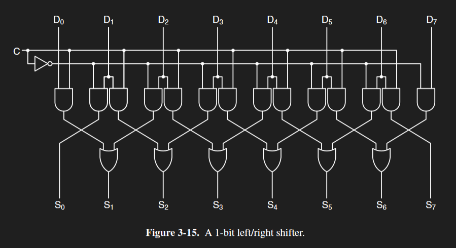

Each $D$ (data) line is connected to two AND gates; one AND gate connects to the output bit to the left of it and the other connects to the output bit to the right of it.
 - Ex: $D_2$ connects to $S_1$ and $S_3$
 - Ex: $D_4$ connects to $S_3$ and $S_5$

The AND gates enable that shift direction based on the $C$ (control) line’s parity ($0$ = left, $1$ = right).

Each $S$ (shift) line has two $D$ lines connected to it (ex: $S_3$ is connected to $D_2$ and $D_4$), the $D$ lines are sent into an OR gate before outputting. What's nice is that only one of these inputs will be active at a time:
- If we’re shifting left, $D_4$ connects to $S_3$ and $D_2$ connects to $S_1$ instead of $D_3$.
- If we’re shifting right, $D_2$ connects to $S_3$ and $D_4$ connects to $S_5$ instead of $D_3$.

Jason didn't provide any questions on bit shifting in the videos.