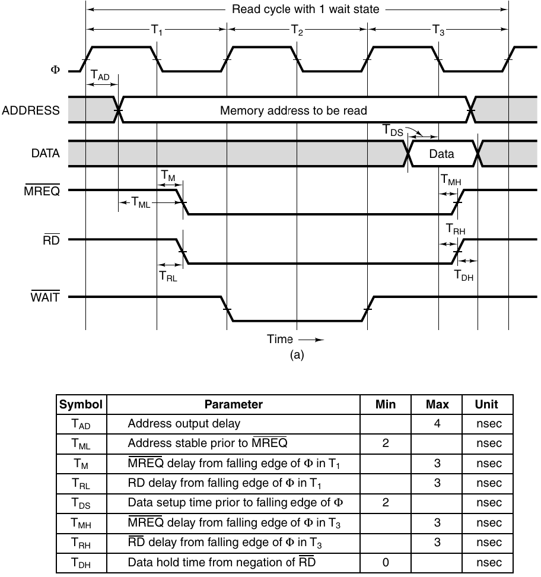

---
author:
    - name: felistachio
      avatar: "https://avatars.githubusercontent.com/u/181042133?v=4"
      link: "https://github.com/pnguyen72/"
label: "Week 6: Synchronous Bus"
description: "How long does memory have to fetch the word from when address is stable?"
image: https://quiz.comp1712.ca/images/license.png
icon: info
---

## Terminologies

-   $T_{n}$: clock cycles
-   $T_{AD}$: how long from the beginning to when address is stable
-   $MREQ$: memory request is asserted. $MREQ$ requires 2 conditions:
    -   _(a)_: $T_{ML}$ time has passed since address is stable
    -   _(b)_: $T_{M}$ time has passed since the falling edge of the first cycle. 
Memory request is assered when _both_ (a) and (b) are met.
-   $T_{DS}$: how long data must be ready before it can be read

## How it works

You actually don't need to look at the diagram, you just need to use the numbers given. (Although the diagram may help refresh your memory of the formulas.)

You will be given the bus frequency, from which you can calculate the duration of a cycle. The total time from the beginning of the diagram to when memory is read is always $(1.5 + wait)$ cycles. For example, if you're know there are 3 wait cycles, the total time is 4.5 cycles.

#### How long does memory have to fetch the word from when address is stable?

**Steps:**

1. Total = (1.5 + wait) cycles. Given the bus frequency, convert this to nanoseconds (or whatever applicable unit of time, but it's usually $ns$).

2. Address is stable after $T_{AD}$

3. Data must be ready $T_{DS}$ before it's read.

**Answer:** Total time - $T_{AD}$ - $T_{DS}$

#### How long does memory have to fetch the word from when memory request is asserted?

**Steps:**

1. Find the total time (same as above).

2. Find how long from the beginning to when memory request is asserted.

    - $MREQ$ requires 2 conditions: (a) $T_{ML}$ has passed since address is stable, and (b) $T_{M}$ has passes since the falling edge of the first cycle.
    - (a) = $T_{AD} + T_{ML}$
    - (b) = duration of half a cycle + $T_{M}$
    - Therefore, $T_{MREQ}\ =\ \text{max}(T_{AD} + T_{ML}, \text{ duration of half a cycle} + T_{M})$  
      (max because _both_ conditions must be satisfied).

3. Data must be ready $T_{DS}$ before it's read.

**Answer:** Total time - $T_{MREQ}$ - $T_{DS}$

## Practice problem

Given:

-   There is one wait state.
-   Bus frequency is 400 MHz
-   $T_{AD} = 1ns$
-   $T_{ML} = 2ns$
-   $T_{M} = 3ns$
-   $T_{DS} = 5ns$

#### How long does memory have to fetch the word from when address is stable?

400 MHz frequency ==> 25 ns/cycle.

1 wait state ==> total time is 2.5 cycles = 2.5(25) = 62.5 ns.

**Answer:** Total time - $T_{AD}$ - $T_{DS}$ = 62.5 - 1 - 5 = **56.5 ns**.

#### How long does memory have to fetch the word from when memory request is asserted?

Calculate how long from the beginining to when memory request is asserted ($T_{MREQ}$):

-   (a) = $T_{AD} + T_{ML} = 3ns$
-   (b) = duration of half a cycle + $T_{M} = 25/2 + 3 = 15.5\ ns$
-   $T_{MREQ} = \text{max}(a, b) = 15.5\ ns$

**Answer:** Total time - $T_{MREQ}$ - $T_{DS}$ = 62.5 - 15.5 - 5 = **42 ns**.
